<!-- ═══════════════════════════════════════════════════════════════ -->
<!--                    🎙️ TEXT-TO-SPEECH APP                       -->
<!-- ═══════════════════════════════════════════════════════════════ -->

<div align="center">


<a href="https://github.com/JADAVDHRUVIT21/Text-to-Speech">
  
</a>

<br/>

<!-- ═══ BADGES ═══ -->
<p>
  
  
  
  
</p>

<p>
  
  
  
  
</p>

<p>
  <a href="https://github.com/JADAVDHRUVIT21/Text-to-Speech/stargazers">
    
  </a>
  <a href="https://github.com/JADAVDHRUVIT21/Text-to-Speech/network/members">
    
  </a>
  <a href="https://github.com/JADAVDHRUVIT21/Text-to-Speech/issues">
    
  </a>
  
  
  
</p>

<br/>

<!-- ═══ NAVIGATION ═══ -->
<p>
  <a href="#-overview"><b>Overview</b></a> ·
  <a href="#-features"><b>Features</b></a> ·
  <a href="#-screenshots"><b>Screenshots</b></a> ·
  <a href="#-tech-stack"><b>Tech Stack</b></a> ·
  <a href="#-installation"><b>Installation</b></a> ·
  <a href="#-api-documentation"><b>API</b></a> ·
  <a href="#-roadmap"><b>Roadmap</b></a>
</p>

</div>


---

## 🌟 Overview

<div align="center">

> **A modern, responsive web application that turns your text into natural-sounding speech**
> across **multiple languages** and **multiple voices** — powered by AI translation.

</div>

<table>
<tr>
<td width="60%" valign="top">

### 💡 What Makes It Special?

- 🌍 **Speaks 20+ languages** with native-sounding voices
- 🤖 **AI translation** before speech — speak any text in any language
- 🎨 **Beautiful responsive UI** with light/dark modes
- 🔒 **Secure** with JWT auth & bcrypt password hashing
- 📜 **Automatic history** — replay & redownload anytime
- ⚡ **Zero audio storage** on backend — privacy first

</td>
<td width="40%" align="center">


</td>
</tr>
</table>


---

## ✨ Features

<div align="center">

### 🎯 Everything You Need in One App

</div>

<table>
<tr>
<td width="50%" valign="top">

#### 🎨 Frontend Magic
| Feature | Status |
| :--- | :---: |
| 🗣️ Text-to-speech via Puter.js | ✅ |
| 🌍 Multi-language support | ✅ |
| 🎚️ Dynamic voice selection | ✅ |
| 🔄 AI translation before speech | ✅ |
| 🔢 Real-time word & char count | ✅ |
| ▶️ In-browser audio playback | ✅ |
| ⬇️ One-click audio download | ✅ |
| 🌓 Light / Dark / Custom accent | ✅ |
| 📱 Fully responsive design | ✅ |

</td>
<td width="50%" valign="top">

#### 🔐 Backend & Security
| Feature | Status |
| :--- | :---: |
| 👤 User registration & login | ✅ |
| 🔑 JWT-based authentication | ✅ |
| 🔒 bcrypt password hashing | ✅ |
| 🛡️ Protected API endpoints | ✅ |
| 📜 User-specific history | ✅ |
| 🗑️ Delete / Clear history | ✅ |
| ✅ Backend input validation | ✅ |
| 🩺 Health monitoring | ✅ |
| 🌐 CORS configuration | ✅ |

</td>
</tr>
</table>

<div align="center">

### 🚀 Advanced Capabilities

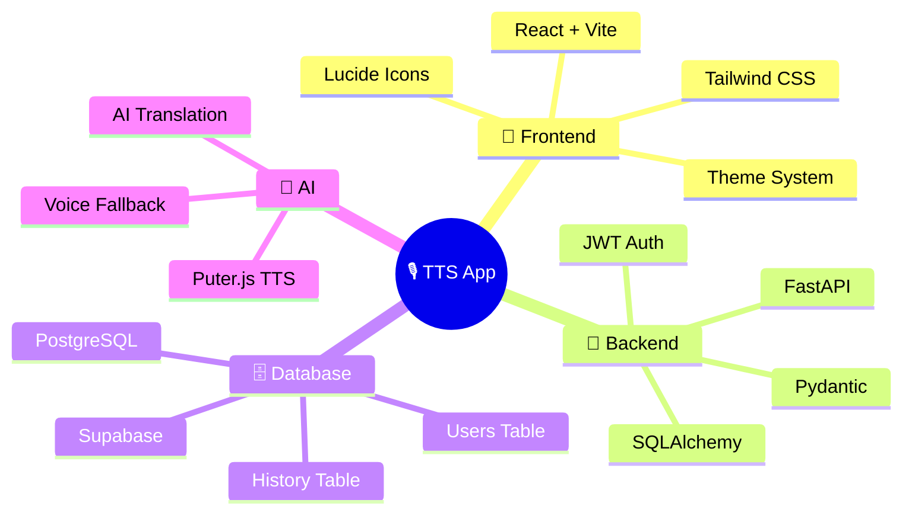

</div>


---

## 🎬 Demo

<div align="center">


<br/><br/>

**🔄 Workflow:** `Enter text` → `Select language` → `Pick voice` → `AI translates` → `TTS generates` → `Play / Download` → `Auto-saved to history`

</div>


---

## 🖼️ Screenshots

<div align="center">

### 🏠 Dashboard
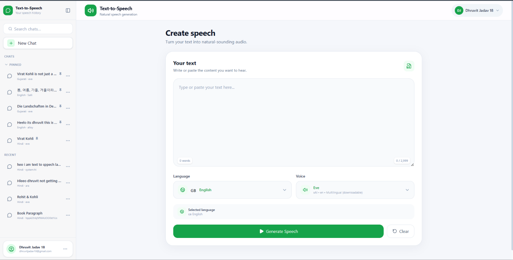

<br/><br/>

### 🔐 Authentication

<table>
<tr>
<td width="50%" align="center">
<b>Login</b><br/>
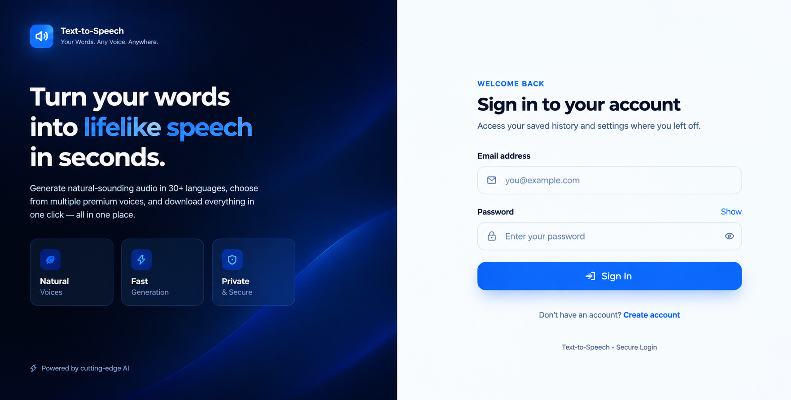
</td>
<td width="50%" align="center">
<b>Register</b><br/>
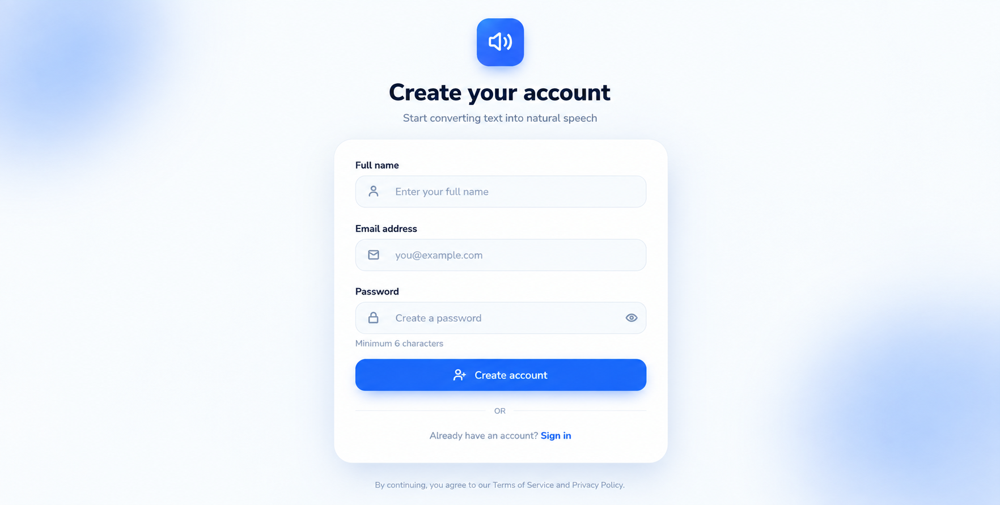
</td>
</tr>
</table>

<br/>

### 📜 Speech History
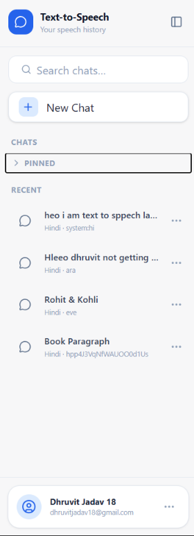

<br/><br/>

### ⚙️ Account & Settings
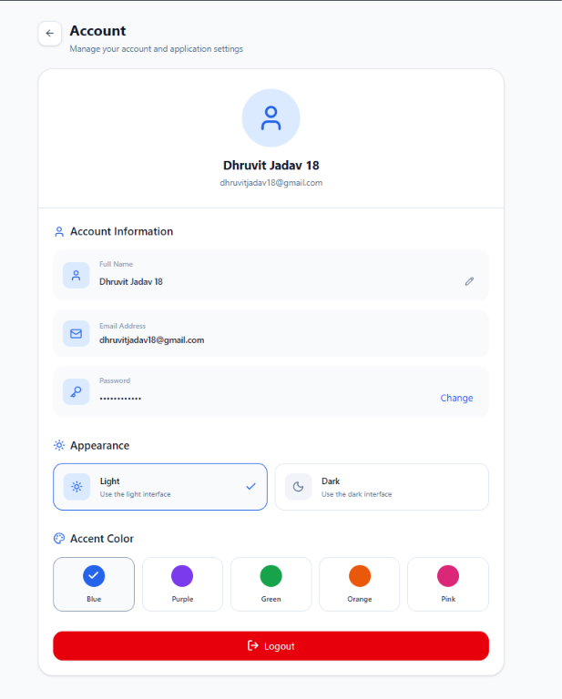

<br/><br/>

### 🔊 Generated Speech
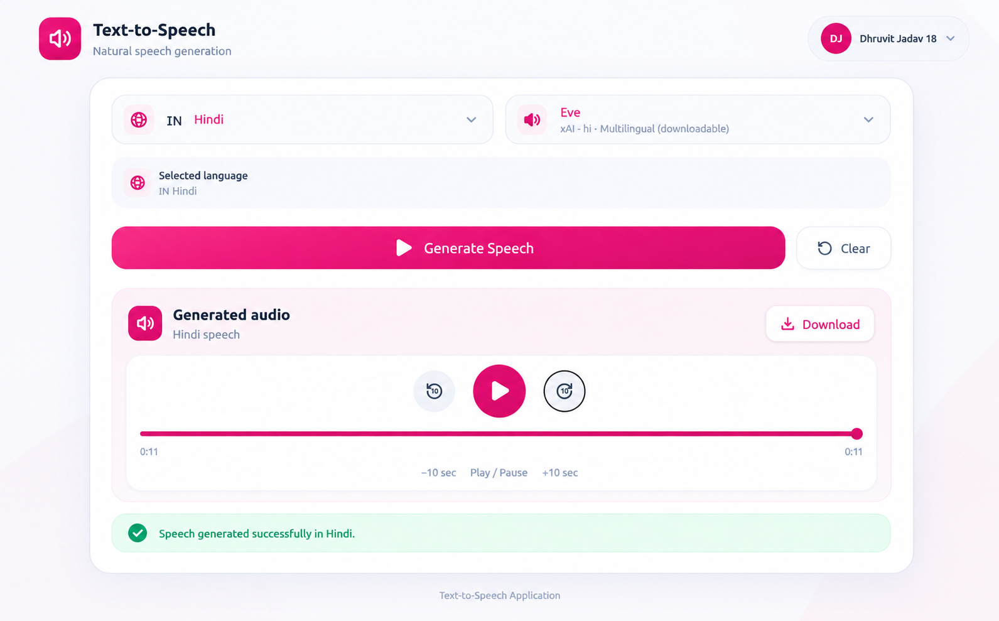

<br/><br/>

### 🌍 Languages & 🎙️ Voices

<table>
<tr>
<td width="50%" align="center">
<b>Supported Languages</b><br/>
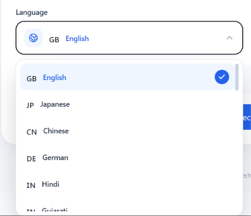
</td>
<td width="50%" align="center">
<b>Voice Selection</b><br/>
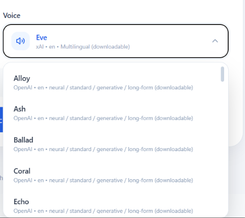
</td>
</tr>
</table>

<br/>

### 🌙 Dark Mode
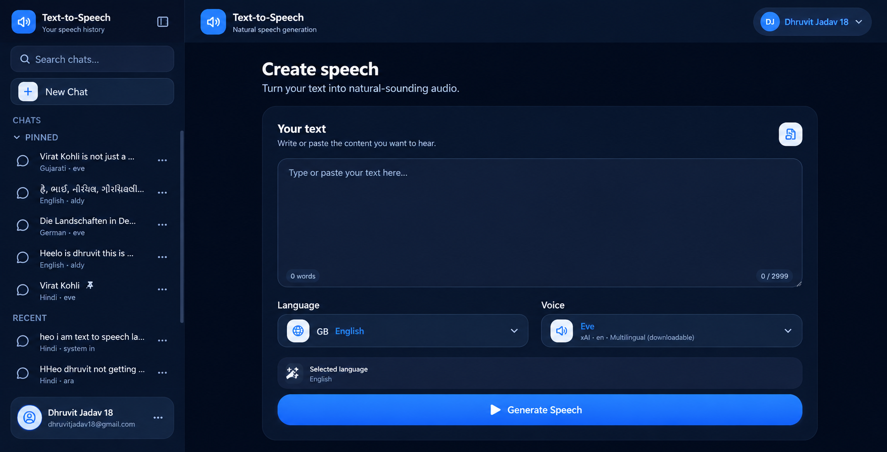

</div>


---

## 🛠️ Tech Stack

<div align="center">

| 🎨 **Frontend** | ⚙️ **Backend** | 🗄️ **Database** | 🤖 **AI & Speech** |
| :---: | :---: | :---: | :---: |
| React 18 | Python 3.10+ | PostgreSQL 15 | Puter.js TTS |
| Vite 5 | FastAPI | Supabase | AI Translation |
| Tailwind CSS 3 | SQLAlchemy | | Voice Fallback |
| Axios | Pydantic | | |
| React Router | JWT | | |
| Lucide React | bcrypt | | |
| Puter.js | Uvicorn | | |

</div>


---

## 🏗️ System Architecture

<div align="center">

```text
    ┌─────────────────────────────────────────┐
    │         🎨 REACT FRONTEND               │
    │  ┌───────────────────────────────────┐  │
    │  │ Dashboard · Auth · Languages      │  │
    │  │ Voices · Player · History · Theme │  │
    │  └───────────────────────────────────┘  │
    └──────────────────┬──────────────────────┘
                       │  🔌 REST API
                       ▼
    ┌─────────────────────────────────────────┐
    │         ⚙️ FASTAPI BACKEND              │
    │  ┌───────────────────────────────────┐  │
    │  │ Auth · JWT · Users · History      │  │
    │  │ Validation · Health · CORS        │  │
    │  └───────────────────────────────────┘  │
    └──────────────────┬──────────────────────┘
                       │
                       ▼
    ┌─────────────────────────────────────────┐
    │      🗄️ POSTGRESQL / SUPABASE          │
    │      users · tts_history                │
    └─────────────────────────────────────────┘
```

</div>

### 🔄 Complete Request Flow

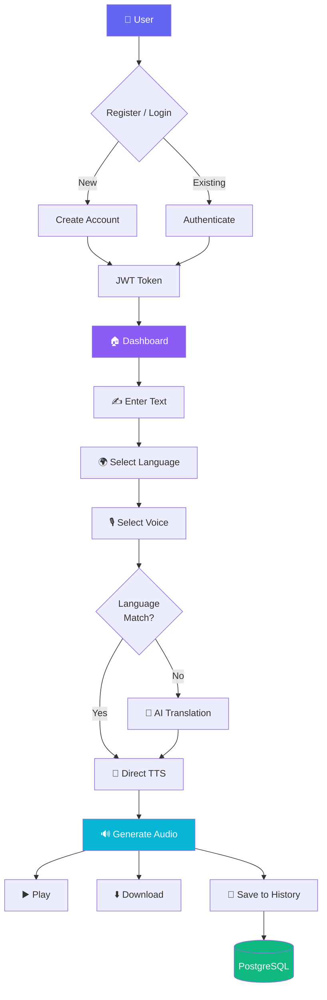


---

## 🚀 Installation

### 📋 Prerequisites

<div align="center">


</div>

### 1️⃣ Clone the Repository

```bash
git clone https://github.com/JADAVDHRUVIT21/Text-to-Speech.git
cd Text-to-Speech
```

### 2️⃣ Backend Setup

```bash
cd backend

# Create & activate virtual environment
python -m venv venv
.\venv\Scripts\Activate.ps1     # Windows PowerShell
# source venv/bin/activate       # macOS / Linux

# Install dependencies
pip install -r requirements.txt
```

**Create `backend/.env`:**

```env
APP_NAME=Text-to-Speech Application
DEBUG=True
DATABASE_URL=your_database_url
SECRET_KEY=your_secret_key
```

**Start the backend:**

```bash
uvicorn app.main:app --reload
```

> 🟢 Backend running at → **http://127.0.0.1:8000**

### 3️⃣ Frontend Setup

**Open a new terminal:**

```bash
cd frontend
npm install
```

**Create `frontend/.env`:**

```env
VITE_API_URL=http://127.0.0.1:8000
```

**Start the dev server:**

```bash
npm run dev
```

> 🟢 Frontend running at → **http://localhost:5173**


---

## 📡 API Documentation

<div align="center">

### 🔌 REST Endpoints

</div>

| Method | Endpoint | Description | Auth |
| :---: | :--- | :--- | :---: |
| `POST` | `/api/auth/register` | Register a new user | 🔓 |
| `POST` | `/api/auth/login` | Authenticate a user | 🔓 |
| `GET` | `/api/auth/me` | Get current user | 🔒 |
| `GET` | `/api/voices` | Get available voices | 🔓 |
| `GET` | `/api/languages` | Get supported languages | 🔓 |
| `GET` | `/api/history` | Get user's speech history | 🔒 |
| `POST` | `/api/history` | Create history record | 🔒 |
| `DELETE` | `/api/history/{id}` | Delete a history item | 🔒 |
| `DELETE` | `/api/history` | Clear user's history | 🔒 |
| `GET` | `/api/health` | Backend + DB health | 🔓 |

### 📚 Interactive Docs

<div align="center">

| 📘 Swagger UI | 📗 ReDoc |
| :---: | :---: |
| [http://127.0.0.1:8000/docs](http://127.0.0.1:8000/docs) | [http://127.0.0.1:8000/redoc](http://127.0.0.1:8000/redoc) |

</div>

### 🩺 Health Check

```bash
curl http://127.0.0.1:8000/api/health
```

```json
{
  "status": "ok",
  "database": "connected",
  "tts": "puter.js"
}
```


---

## 🔐 Authentication Flow

<div align="center">

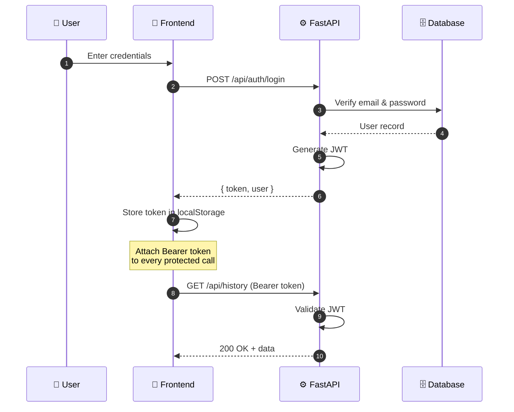

</div>


---

## 🗄️ Database Schema

<div align="center">

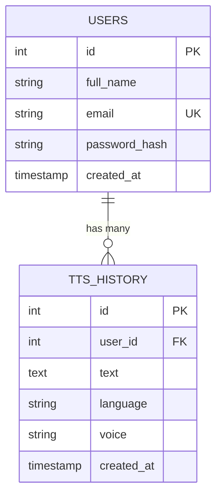

</div>

<table>
<tr>
<td width="50%" valign="top">

### 👤 `users`

```text
┌────────────────────────────────┐
│ id            (PK)             │
│ full_name                      │
│ email         (unique)         │
│ password_hash (bcrypt)         │
│ created_at                     │
└────────────────────────────────┘
```

</td>
<td width="50%" valign="top">

### 📜 `tts_history`

```text
┌────────────────────────────────┐
│ id            (PK)             │
│ user_id       (FK → users.id)  │
│ text                           │
│ language                       │
│ voice                          │
│ created_at                     │
└────────────────────────────────┘
```

</td>
</tr>
</table>


---

## 🎙️ Puter.js Integration

<div align="center">

### 🔊 Text-to-Speech

```text
┌──────────────┐    ┌──────────────────┐    ┌────────────────┐
│  Input Text  │───▶│  AI Translation  │───▶│   Puter TTS    │
└──────────────┘    └──────────────────┘    └────────┬───────┘
                                                     │
                                                     ▼
                                            ┌────────────────┐
                                            │  🔊 Audio Out  │
                                            └────────────────┘
```

</div>

<table>
<tr>
<td width="33%" align="center">

#### 🌐 **Translation**
Auto-translates input text
to the target language
before synthesis

</td>
<td width="33%" align="center">

#### 🔊 **Speech Synthesis**
Generates natural voices
via Puter.js TTS engine
with fallback support

</td>
<td width="33%" align="center">

#### 🎚️ **Voice Management**
Dynamic language-aware
voice loading with smart
fallback handling

</td>
</tr>
</table>


---

## ⚠️ Error Handling

<div align="center">

| 🚨 Error Type | 🛡️ Handled |
| :--- | :---: |
| Empty text / text too long | ✅ |
| Unsupported language | ✅ |
| Invalid voice | ✅ |
| Invalid / expired JWT | ✅ |
| Unauthorized requests | ✅ |
| Missing history item | ✅ |
| Database errors | ✅ |
| TTS service errors | ✅ |
| Translation errors | ✅ |
| Network / API failures | ✅ |

</div>


---

## 📱 Responsive Design

<div align="center">

| 🖥️ Desktop | 💻 Laptop | 📱 Tablet | 📞 Mobile |
| :---: | :---: | :---: | :---: |
| ✅ | ✅ | ✅ | ✅ |

</div>

> Navigation, sidebar, forms, audio controls, history, and settings all adapt fluidly to any screen size.


---

## ⚙️ Account & Settings

<div align="center">

| 🎨 Setting | Description |
| :--- | :--- |
| 👤 Account Info | View & manage personal details |
| ☀️ Light Mode | Clean, bright interface |
| 🌙 Dark Mode | Eye-friendly dark theme |
| 🎨 Accent Color | Customize primary color |
| 🚪 Logout | Secure session end |

</div>

> 💾 Settings persist locally across refreshes.


---

## 🔒 Security

<div align="center">

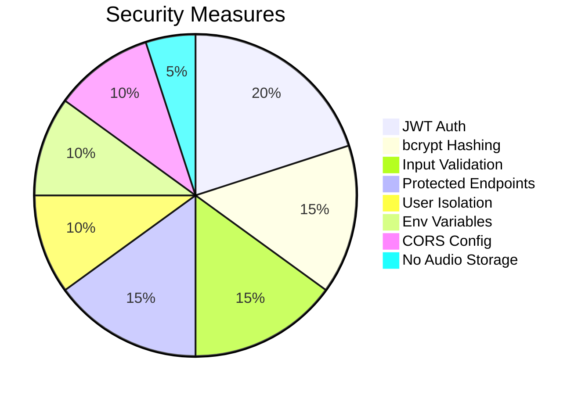

</div>

- 🔑 **JWT-based** authentication
- 🔐 **bcrypt** password hashing
- 🛡️ **Protected** authenticated endpoints
- 👥 **User-specific** speech history
- ✅ **Backend-side** input validation
- 📏 **Max text length** validation
- 🌱 **Environment variables** for secrets
- 🚫 `.env` **excluded** from Git
- 🙈 **No sensitive API keys** in frontend
- 🌐 **CORS** configured
- 🧊 **No permanent audio storage**
- 🔒 **User data isolation**


---

## 🌱 Environment Variables

<table>
<tr>
<td width="50%" valign="top">

### ⚙️ Backend (`backend/.env`)

```env
APP_NAME=Text-to-Speech Application
DEBUG=True
DATABASE_URL=your_database_url
SECRET_KEY=your_secret_key
```

</td>
<td width="50%" valign="top">

### 🎨 Frontend (`frontend/.env`)

```env
VITE_API_URL=http://127.0.0.1:8000
```

</td>
</tr>
</table>

> ⚠️ **Never commit real credentials, database URLs, or private keys.**


---

## 🧪 Development

<div align="center">

### 🚀 Quick Start (Two Terminals)

</div>

<table>
<tr>
<td width="50%" valign="top">

**Terminal 1 — Backend**

```bash
cd backend
.\venv\Scripts\Activate.ps1
uvicorn app.main:app --reload
```

</td>
<td width="50%" valign="top">

**Terminal 2 — Frontend**

```bash
cd frontend
npm run dev
```

</td>
</tr>
</table>

### 🩺 Health Check

```bash
curl http://127.0.0.1:8000/api/health
```


---

## 🗺️ Roadmap

- [ ] 🔗 Social login & OAuth
- [ ] 📦 Progressive Web App (PWA)
- [ ] 🤖 Native Android app
- [ ] 🍎 Native iOS app
- [ ] 🎚️ Speech speed & pitch controls
- [ ] ⭐ Favorite voices
- [ ] 🔍 Advanced history search
- [ ] 📊 Usage analytics
- [ ] ☁️ Cloud audio storage
- [ ] 🚦 Improved rate limiting


---

## 🤝 Contributing

<div align="center">

**Contributions are welcome! 🎉**

</div>

```bash
# 1. Fork the repo 🍴
# 2. Create your branch
git checkout -b feature/AmazingFeature

# 3. Commit your changes
git commit -m "Add AmazingFeature"

# 4. Push to branch
git push origin feature/AmazingFeature

# 5. Open a Pull Request ✅
```


---

## 📄 License

<div align="center">

This project was developed for **educational and internship purposes**.
For reuse beyond that scope, please contact the author.

</div>


---

## 👨‍💻 Author

<div align="center">


### **Dhruvit Jadav**

Full-Stack Developer 

<a href="https://github.com/JADAVDHRUVIT21">
  
</a>
<a href="https://github.com/JADAVDHRUVIT21/Text-to-Speech">
  
</a>

<br/><br/>

### ⭐ If you found this project helpful, please give it a star!


<br/>

**Made with ❤️ using React · FastAPI · Puter.js**

<br/>


</div>