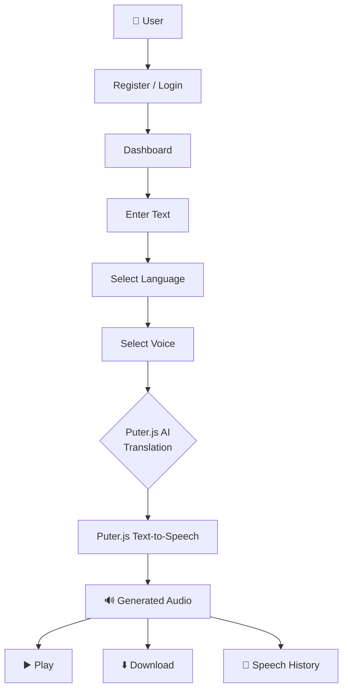
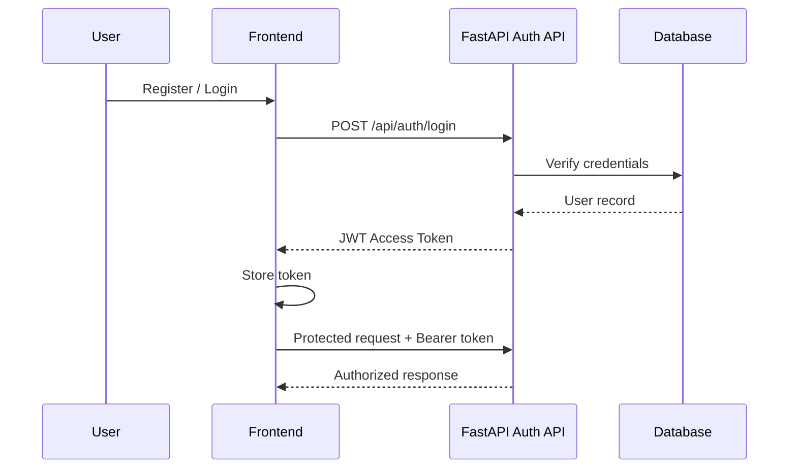

<div align="center">

# 🎙️ Text-to-Speech Application

### Convert text into natural-sounding speech across multiple languages and voices

[](https://react.dev/)
[](https://vitejs.dev/)
[](https://tailwindcss.com/)
[](https://fastapi.tiangolo.com/)
[](https://www.postgresql.org/)
[](https://supabase.com/)
[](#-license)

[](https://github.com/JADAVDHRUVIT21/Text-to-Speech/stargazers)
[](https://github.com/JADAVDHRUVIT21/Text-to-Speech/network/members)
[](https://github.com/JADAVDHRUVIT21/Text-to-Speech/issues)

**[Features](#-features) · [Screenshots](#-screenshots) · [Installation](#-installation) · [API Docs](#-api-documentation) · [Tech Stack](#-tech-stack)**

</div>

---

## 📖 Overview

A modern, responsive web application that converts text into natural-sounding speech across multiple languages and voices. Built with a **React + Vite** frontend, a **FastAPI** backend, **PostgreSQL (Supabase)** for persistence, and **Puter.js** for AI-powered translation and text-to-speech.

> 💡 **Highlight:** The app automatically translates input text to the target language before generating speech — perfect for multilingual content.

---

## ✨ Features

<table>
<tr>
<td width="50%" valign="top">

### 🎨 Frontend
- 🗣️ Text-to-speech via Puter.js
- 🌍 Multiple language support
- 🎚️ Dynamic voice selection
- 🔄 AI translation before speech
- 🔢 Real-time word & character count
- ▶️ In-browser audio playback
- ⬇️ Audio download
- 🌓 Light / Dark / Custom accent themes
- 📱 Fully responsive (mobile → desktop)

</td>
<td width="50%" valign="top">

### 🔐 Backend & Security
- 👤 User registration & login
- 🔑 JWT-based authentication
- 🔒 bcrypt password hashing
- 🛡️ Protected API endpoints
- 📜 User-specific speech history
- 🗑️ Delete one / clear all history
- ✅ Backend input validation
- 🩺 Health monitoring endpoint
- 🌐 CORS configuration

</td>
</tr>
</table>

---

## 🖼️ Screenshots

<div align="center">

### 🏠 Dashboard


### 🔐 Login & Register
| Login | Register |
| :---: | :---: |
|  |  |

### 📜 Speech History


### ⚙️ Account & Settings


### 🔊 Generated Speech


### 🌍 Languages & Voices
| Languages | Voices |
| :---: | :---: |
|  |  |

### 🌙 Dark Mode


</div>

---

## 🛠️ Tech Stack

| Layer | Technologies |
| :--- | :--- |
| **Frontend** | React, Vite, Tailwind CSS, Axios, React Router, Lucide React, Puter.js |
| **Backend** | Python, FastAPI, SQLAlchemy, Pydantic, JWT, bcrypt |
| **Database** | PostgreSQL (hosted on Supabase) |
| **Speech & AI** | Puter.js Text-to-Speech, Puter.js AI Translation |

---

## 🏗️ System Architecture

```text
┌─────────────────────────────────┐
│         React Frontend          │
│  Dashboard · Auth · Languages   │
│  Voices · Player · History      │
└───────────────┬─────────────────┘
                │  REST API
                ▼
┌─────────────────────────────────┐
│         FastAPI Backend         │
│  Auth · JWT · Users · History   │
│  Validation · Health            │
└───────────────┬─────────────────┘
                │
                ▼
┌─────────────────────────────────┐
│      PostgreSQL / Supabase      │
│      users · tts_history        │
└─────────────────────────────────┘
```

### 🔄 Request Flow



---

## 🚀 Installation

### 📋 Prerequisites

- **Node.js** ≥ 18
- **Python** ≥ 3.10
- **PostgreSQL** database (or Supabase account)
- Git

### 1️⃣ Clone the Repository

```bash
git clone https://github.com/JADAVDHRUVIT21/Text-to-Speech.git
cd Text-to-Speech
```

### 2️⃣ Backend Setup

```bash
cd backend

# Create & activate a virtual environment (Windows PowerShell)
python -m venv venv
.\venv\Scripts\Activate.ps1

# macOS / Linux:
# source venv/bin/activate

# Install dependencies
pip install -r requirements.txt
```

Create a `.env` file inside `backend/`:

```env
APP_NAME=Text-to-Speech Application
DEBUG=True
DATABASE_URL=your_database_url
SECRET_KEY=your_secret_key
```

Start the backend server:

```bash
uvicorn app.main:app --reload
```

Backend runs at → **http://127.0.0.1:8000**

### 3️⃣ Frontend Setup

Open a **new terminal**:

```bash
cd frontend
npm install
```

Create a `.env` file inside `frontend/`:

```env
VITE_API_URL=http://127.0.0.1:8000
```

Start the dev server:

```bash
npm run dev
```

Frontend runs at → **http://localhost:5173**

---

## 📡 API Documentation

The FastAPI backend exposes REST endpoints for authentication, user management, voices, languages, speech history, and health checks.

| Method | Endpoint | Description |
| :---: | :--- | :--- |
| `POST` | `/api/auth/register` | Register a new user |
| `POST` | `/api/auth/login` | Authenticate a user |
| `GET` | `/api/auth/me` | Get current authenticated user |
| `GET` | `/api/voices` | Get available voices |
| `GET` | `/api/languages` | Get supported languages |
| `GET` | `/api/history` | Get user's speech history |
| `POST` | `/api/history` | Create a speech history record |
| `DELETE` | `/api/history/{history_id}` | Delete a history item |
| `DELETE` | `/api/history` | Clear the user's history |
| `GET` | `/api/health` | Backend + DB health check |

### 📚 Interactive Docs (auto-generated by FastAPI)

- **Swagger UI** → [http://127.0.0.1:8000/docs](http://127.0.0.1:8000/docs)
- **ReDoc** → [http://127.0.0.1:8000/redoc](http://127.0.0.1:8000/redoc)

### 🩺 Health Check Example

```bash
GET /api/health
```

```json
{
  "status": "ok",
  "database": "connected",
  "tts": "puter.js"
}
```

---

## 🔐 Authentication

JWT-based authentication protects all user-specific resources.



The frontend stores the session and sends `Authorization: Bearer <token>` on protected calls.

---

## 🗄️ Database Schema

### `users`

```text
users
├── id              (PK)
├── full_name
├── email           (unique)
├── password_hash
└── created_at
```

### `tts_history`

```text
tts_history
├── id              (PK)
├── user_id         (FK → users.id)
├── text
├── language
├── voice
└── created_at
```

### 📜 History Management

Authenticated users can:
- 👁️ View their history
- ➕ Create history records
- 🗑️ Delete a single item
- 🧹 Clear all history
- 🔒 Keep history isolated per user

---

## 🎙️ Puter.js Integration

Puter.js handles speech generation **on the frontend**.

### 🔊 Text-to-Speech
- Generates speech from text
- Supports multiple voices & languages
- Returns a playable audio element

### 🌐 AI Translation

When the selected language differs from the input text, Puter.js AI translates **before** synthesis:

```text
Input Text → Selected Language → AI Translation → TTS → 🔈 Audio
```

### 🎚️ Voice Management
- Dynamic language-aware voice loading
- Compatible voice filtering per language
- Fallback voice handling when a provider/voice is unavailable

---

## ⚠️ Error Handling

The app gracefully handles:

- Empty text / text too long
- Unsupported language or invalid voice
- Invalid or expired JWT
- Unauthorized requests
- Missing history items
- Database errors
- TTS / translation service errors
- Network / API failures

Validation happens on the correct side (client or server) and errors are surfaced in the UI.

---

## 📱 Responsive Design

Optimized for:

| Device | Status |
| :--- | :---: |
| 🖥️ Desktop | ✅ |
| 💻 Laptop | ✅ |
| 📱 Tablet | ✅ |
| 📞 Mobile | ✅ |

Navigation, sidebar, forms, audio controls, history, and settings all adapt fluidly.

---

## ⚙️ Account & Settings

- 👤 Account information
- ☀️ Light appearance
- 🌙 Dark appearance
- 🎨 Accent color customization
- 🚪 Logout

Preferences persist locally across refreshes.

---

## 🔒 Security

- 🔑 JWT-based authentication
- 🔐 Password hashing with bcrypt
- 🛡️ Protected authenticated endpoints
- 👥 User-specific speech history
- ✅ Backend-side input validation
- 📏 Max text length validation
- 🌱 Environment variables for secrets
- 🚫 `.env` excluded from Git
- 🙈 No sensitive API keys in the frontend
- 🌐 CORS configured
- 🧊 No permanent backend storage of audio

---

## 🌱 Environment Variables

**Backend (`backend/.env`)**

```env
APP_NAME=Text-to-Speech Application
DEBUG=True
DATABASE_URL=your_database_url
SECRET_KEY=your_secret_key
```

**Frontend (`frontend/.env`)**

```env
VITE_API_URL=http://127.0.0.1:8000
```

> ⚠️ **Never commit real credentials, database URLs, or private keys.**

---

## 🧪 Development

**Terminal 1 — Backend**
```bash
cd backend
.\venv\Scripts\Activate.ps1     # Windows
# source venv/bin/activate       # macOS / Linux
uvicorn app.main:app --reload
```

**Terminal 2 — Frontend**
```bash
cd frontend
npm run dev
```

**Health check**
```bash
curl http://127.0.0.1:8000/api/health
```

---

## 🗺️ Roadmap

- [ ] 🔗 Social login & OAuth
- [ ] 📦 Progressive Web App (PWA)
- [ ] 🤖 Native Android app
- [ ] 🍎 Native iOS app
- [ ] 🎚️ Speech speed & pitch controls
- [ ] ⭐ Favorite voices
- [ ] 🔍 Advanced history search & filters
- [ ] 📊 Usage analytics & statistics
- [ ] ☁️ Cloud audio storage
- [ ] 🚦 Improved rate limiting

---

## 🤝 Contributing

Contributions are welcome!

1. Fork the repo 🍴
2. Create a branch: `git checkout -b feature/amazing-feature`
3. Commit: `git commit -m "Add amazing feature"`
4. Push: `git push origin feature/amazing-feature`
5. Open a Pull Request ✅

---

## 📄 License

This project was developed for **educational and internship purposes**.
For reuse beyond that scope, please contact the author.

---

## 👨‍💻 Author

<div align="center">

**Dhruvit Jadav**

[](https://github.com/JADAVDHRUVIT21)
[](https://github.com/JADAVDHRUVIT21/Text-to-Speech)

</div>

---

<div align="center">

### ⭐ If you found this project helpful, please give it a star!

Made with ❤️ using React, FastAPI, and Puter.js

</div>

## 🎬 Demo

<div align="center">
  
</div>